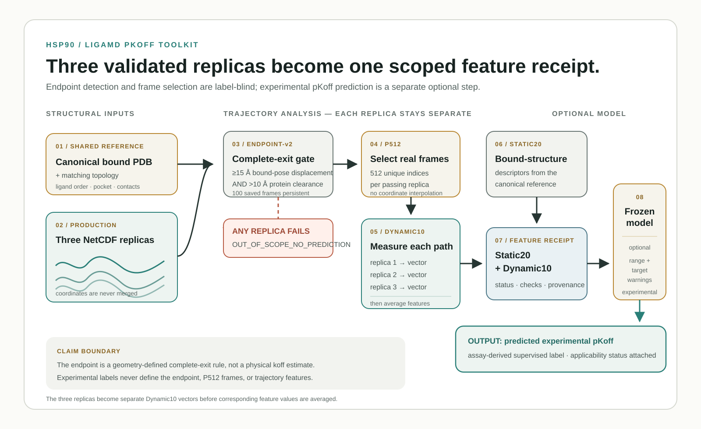

# LiGaMD pKoff Toolkit

This repository gives a researcher one reproducible route from a new LiGaMD
production campaign to two different kinds of output.

The first output is a set of trajectory measurements. The toolkit reads three
replicas, identifies a geometry-defined complete-exit episode, selects 512
real saved frames from each replica, and turns those frames into 20 static and
10 dynamic features.

The second output is optional. Four bundled regression pipelines can turn a
feature vector into a **predicted experimental pKoff**. That target is an
assay-derived label. It is not a physical dissociation rate calculated from a
simulation clock, and the bundled models remain `EXPERIMENTAL`.

## Workflow at a glance



The upper route is label-blind trajectory analysis. Each replica must pass the
same geometry-and-persistence endpoint, then contributes its own P512-based
Dynamic10 vector; corresponding feature values are averaged only after that.
The optional model consumes the resulting feature receipt and predicts an
assay-derived experimental label with applicability warnings. The red branch
is the fail-closed result when any replica does not support the required
episode.

## Choose the next document by the question you have

The repository separates four kinds of documentation so that an instruction
page does not hide an important definition, and a reference page does not make
you read a lesson before you can work.

| Your question | Document type | Start here |
| --- | --- | --- |
| “Can I see one complete run before I prepare real data?” | Tutorial | [Run the synthetic three-replica campaign](docs/tutorial-synthetic-campaign.md). It is a guided lesson and requires a source clone because it uses the repository's `examples/` generator. |
| “How do I prepare my own three production replicas?” | How-to guide | [Prepare a real LiGaMD input set](docs/prepare-real-inputs.md). It assumes you already know your simulation and leads to one manifest and one `featurize` command. |
| “What does this field, status, unit, or input path mean?” | Reference | [Input-manifest reference](docs/input-manifest.md), [feature reference](docs/feature-definitions.md), and [model card](MODEL_CARD.md). |
| “Why does the workflow use this episode boundary, sampler, grouping, or evidence rule?” | Explanation | [Episode and sampler explanation](docs/endpoint-and-sampler.md), [method evidence ledger](docs/method-evidence.md), and [model-development roadmap](docs/model-development-roadmap.md). |

The [code map](docs/code-map.md) is for readers who want to trace a documented
operation into the public source code.

## What happens in one run

```text
canonical bound PDB + topology + three production NetCDF files
    -> freeze ligand atom order, pocket residues, and native contacts
    -> inspect every saved frame using two geometric complete-exit conditions
    -> keep frame 0 through the first persistence-confirmed exit onset
    -> select 512 unique real P512 frames from each replica
    -> calculate Static20 and Dynamic10
    -> average the three Dynamic10 vectors
    -> optionally apply a frozen experimental-pKoff model
```

The three replicas are never merged as coordinates. Each replica becomes one
Dynamic10 vector first. Only corresponding feature values are averaged.

## Install from a clone

The supplied Conda environment contains the scientific dependencies, including
RDKit for ligand descriptors.

```bash
git clone https://github.com/alex051107/ligamd-pkoff-toolkit.git
cd ligamd-pkoff-toolkit
conda env create -f environment.yml
conda activate ligamd-pkoff-toolkit
python -m pip install --no-build-isolation .
```

The command line entry point is then available as `ligamd-pkoff`. The endpoint
contract, P512 contract, model registry, score tables, and four frozen model
artifacts are installed with the package. You do not need to point the command
at a source checkout. Advanced users may override a contract or registry path,
but that creates a different analysis configuration and should be recorded.

## Verify an installed wheel without data

The complete synthetic lesson below uses a generator stored in `examples/`, so
it is deliberately a **clone-only tutorial**. A researcher who installed a
built wheel can still confirm that the public command and bundled resources are
present without being promised an example that the wheel does not ship.

```bash
python - <<'PY'
from ligamd_pkoff.resources import bundled_path

resources = [
    "contracts/endpoint_v2.json",
    "contracts/p512_sampler_v1.json",
    "models/experimental_n31_registry_v1/model_registry.json",
    "models/experimental_n31_registry_v1/models/combined30_p512_ridge.joblib",
]
for resource in resources:
    path = bundled_path(resource)
    assert path.is_file(), path
    print(path.name)
PY

ligamd-pkoff --help
```

This is an installation smoke check only. It does not read a trajectory, test
an endpoint, or establish that a model is applicable to a new system. Continue
with [the real-input how-to](docs/prepare-real-inputs.md) when your production
files are ready.

## Walk through the full route from a clone

The synthetic campaign deliberately creates three tiny coordinate files. It is
only an installation and file-wiring check. It is not a molecular simulation
and it does not validate a biological claim.

This tutorial calls `examples/make_synthetic_three_replica_campaign.py`, which
is available from a source clone and is not installed with a wheel. If you only
have a wheel, use the smoke check above and then prepare real inputs with the
[how-to guide](docs/prepare-real-inputs.md).

```bash
python examples/make_synthetic_three_replica_campaign.py \
  --output-dir /tmp/ligamd-pkoff-synthetic

ligamd-pkoff featurize \
  --manifest /tmp/ligamd-pkoff-synthetic/manifest.json \
  --output-dir /tmp/ligamd-pkoff-features
```

If the endpoint passes in all three replicas, the output directory contains
`trajectory_status.tsv`, `endpoint_events.tsv`, `replica_events.tsv`,
`system_features.tsv`, and `features.json`. If even one replica fails the
endpoint rule, `features.json` records `OUT_OF_SCOPE_NO_PREDICTION`. The code
does not replace a missing replica with a partial average.

The synthetic target name is not part of the N31 training panel, so a bundled
model will correctly issue an applicability warning if you try to predict it.

## Apply one experimental baseline

Use a feature receipt generated by `featurize`. The four model identifiers are
shown in the table below.

```bash
ligamd-pkoff predict \
  --features /path/to/features.json \
  --model-id combined30_p512_ridge \
  --output /path/to/prediction.json
```

`prediction.json` includes the number, an applicability status, and the
reason for any warning. A warning does not silently turn into a confident
prediction. In particular, the N31 registry does not yet preserve one
authoritative saved-frame cadence for its dynamic profiles. Current
Combined30 predictions therefore carry a cadence-comparability warning even
when all numerical features are in range.

You may compare a completed prediction with a label table that **you are
authorized to use**. Keep this step separate from feature extraction. The
label must never influence the endpoint or the frame selection.

```bash
ligamd-pkoff evaluate \
  --predictions /path/to/prediction.json \
  --labels /path/to/authorized_labels.tsv \
  --output /path/to/evaluation.json
```

The label table needs `system_id` and `experimental_pKoff` columns. One such
comparison is an error measurement for one system. It is not a new external
validation cohort.

## Bundled models and the current evidence

The registry was fitted on a frozen N31 engineering panel with 31 systems and
27 exact-ligand groups. An outer validation fold held out an entire exact
ligand group. This prevents the same standardized ligand chemistry from being
both a training and a test item in that fold. It does not establish
generalization to a truly unseen protein family.

The target and grouping terms have precise meanings. An experimental pKoff is
the assay label derived from an experimental dissociation-rate constant: when
the assay reports `koff` in s<sup>−1</sup>, `pKoff = −log10(koff / 1 s<sup>−1</sup>)`.
It is therefore a dimensionless logarithmic quantity; an MAE reported in
“pKoff” is an error in log<sub>10</sub> units. An exact-ligand group is an
audited chemical-identity group, not a PDB identifier or a protein name. The
public release describes the grouping policy in the [model card](MODEL_CARD.md)
without disclosing campaign-specific identities or labels.

| Model ID | Inputs | Group-equal MAE | What it is for |
| --- | --- | ---: | --- |
| `static20_ridge` | Static20 | 0.8845 | linear static reference |
| `static20_random_forest` | Static20 | 0.8501 | nonlinear static reference |
| `combined30_p512_ridge` | Static20 plus P512 Dynamic10 | 0.8182 | dynamic-information candidate |
| `combined30_p512_random_forest` | Static20 plus P512 Dynamic10 | 0.8275 | nonlinear dynamic-information candidate |

Those numbers are point estimates, not a declaration of a winner. The grouped
Dummy baseline predicts the median experimental pKoff among the training rows
in each outer fold, then makes that same no-feature prediction for every row in
the held-out ligand group. For the lowest-MAE model, the paired bootstrap
interval against that baseline was `[-0.2805, +0.0067] pKoff`; it crosses zero.
The direct Static20-versus-Combined30 comparison is also not stable enough to
select Dynamic10. See [the aggregate paired comparison](ligamd_pkoff/resources/models/experimental_n31_registry_v1/paired_dynamic_increment.tsv)
and [the model-development roadmap](docs/model-development-roadmap.md).

## What this repository intentionally does not contain

The repository excludes raw NetCDF trajectories, topology files, production
logs, campaign-specific label tables, full out-of-fold predictions, source
papers, and internal identity reconciliation records. The model scorecard is
aggregate-only. See [DATA_NOTICE.md](DATA_NOTICE.md) for the exact boundary.

## Repository map

| Location | Use it when you need to |
| --- | --- |
| `ligamd_pkoff/resources/contracts/` | inspect the exact endpoint-v2 and P512 rules shipped with every install |
| `scripts/koff_ml/toolkit.py` | run the public feature, prediction, and evaluation commands |
| `scripts/koff_ml/` | inspect the molecular measurements and model utilities |
| `ligamd_pkoff/resources/models/experimental_n31_registry_v1/` | inspect the four bundled models and their aggregate evidence |
| `examples/` | make a small synthetic three-replica campaign |
| `docs/` | understand inputs, features, literature boundaries, and scope |
| `tests/` | run focused public regression checks, including installed-resource assumptions |

The longer [code map](docs/code-map.md) explains which file performs each
scientific operation.

## License, citation, and daily maintenance

The code in this public repository is under the [MIT License](LICENSE). The
license applies to files included here, not to excluded raw data, assay labels,
or third-party sources. Please use [CITATION.cff](CITATION.cff) when citing the
software.

The repository’s [AGENTS.md](AGENTS.md) asks maintainers to publish each
authorized, user-visible change through a focused branch and pull request.
Routine code and documentation edits should receive focused tests and review,
not repetitive full-data hash checks.

Read [CONTRIBUTING.md](CONTRIBUTING.md) before proposing a change to a
scientific contract, a bundled model, or the public data boundary.
